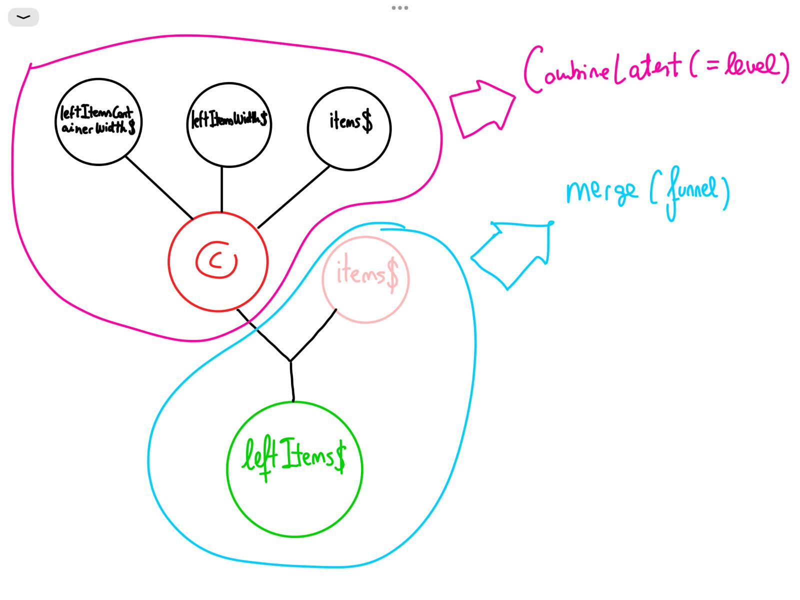

# RxjsGraph

Hay dos tipos de observables de combinacion ( que son los que nos importan a la
hora de saber como se conectan los observables entre si)

## Combinadores en serie (Funnel)

Construyen a partir de la emision de varios observables, una sola emisión.
Es decir, este tipo de combinacion hace que converjan las fuentes.

```
merge mergeWith concat race
```

## Combinadores en paralelo (Sync)

Combinan las fuentes, pero aunque convergan, se lanza un emision cada vez que una de ellas emita, con todas las demás, combinan en paralelo

```
combineLatest, WithLatestFrom, switchMap,
```

# Idea del grafo



Realmente lo importante del grafo, es saber el nombre de los observables que combinandose, forman esa cadena.
